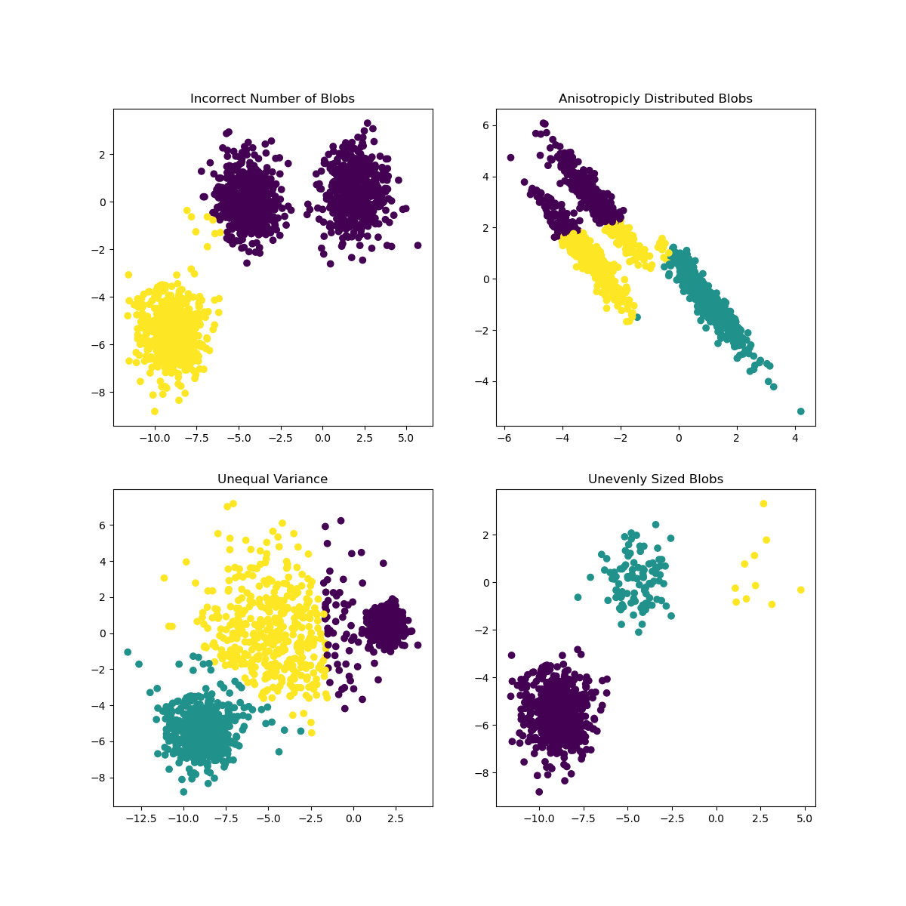
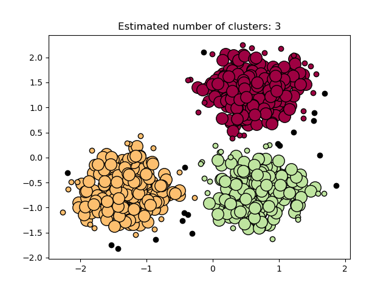

## K-Means
k-means clustering partitions a multi-dimensional data set into k clusters, where each data point belongs to the cluster with the nearest mean, serving as a prototype of the cluster.

> * When you have numeric, multi-dimensional data sets
> * You don't have labels for your data
> * You know exactly how many clusters you want to partition your data into


### Example
```
import (
	"github.com/geoos/clusters/kmeans"
	"github.com/geoos/clusters"
)

// set up a random two-dimensional data set (float64 values between 0.0 and 1.0)
var d clusters.PointList
for x := 0; x < 1024; x++ {
	d = append(d, clusters.Coordinates{
		rand.Float64(),
		rand.Float64(),
	})
}

// Partition the data points into 16 clusters
km := kmeans.New()
clusters, err := km.Partition(d, 16)

for _, c := range clusters {
	fmt.Printf("Centered at x: %.2f y: %.2f\n", c.Center[0], c.Center[1])
	fmt.Printf("Matching data points: %+v\n\n", c.Observations)
}
```

## DBScan

(Lat, lon) points fast clustering using DBScan algorithm in Go.

Given set of geo points, this library can find clusters according to specified params. There are several optimizations applied:

> * distance calculation is using "fast" implementations of sine/cosine, with sqrt being removed
> * to find points within eps distance k-d tree is being used
> * edge case handling of identical points being present in the set


### Example
Build list of points:
```
points := cluster.PointList{{30.258387, 59.951557}, {30.434124, 60.029499}, ...}
```
Pick settings for DBScan algorithm:

> * eps is clustering radius (in kilometers)
> * minPoints is number of points in eps-radius of base point to consider it being part of the cluster

eps and minPoints together define minimum density of the cluster.

Run DBScan:
```
clusters, noise := cluster.DBScan(points, 0.8, 10) // eps is 800m, 10 points minimum in eps-neighborhood

```
DBScan function returns list of clusters (each Cluster being reference to the list of source points) and list of point indexes which don't fit into any cluster (noise).