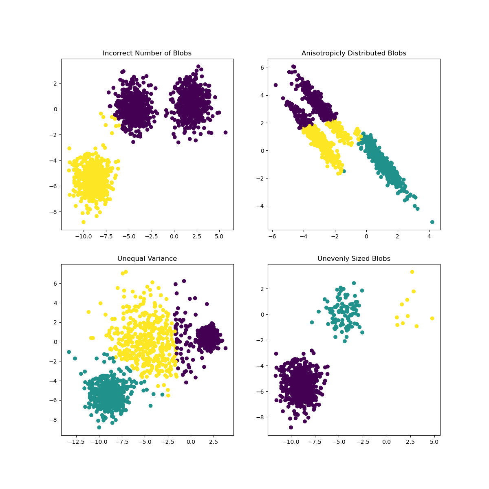
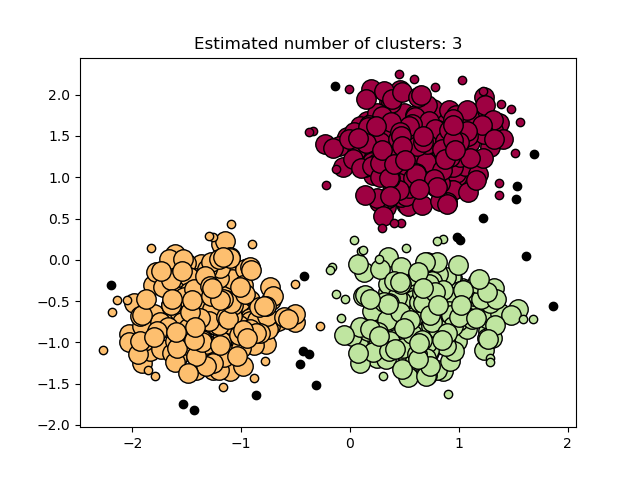

## K-Means
k-means聚类将多维数据集划分为k个聚类，每个数据点属于均值最近的聚类，作为聚类的原型。

k-means通常被称为劳埃德算法。从根本上讲，该算法分为三个步骤。第一步选择初始质心，最基本的方法是选择 数据集中的样本 。初始化后，K-means包括其他两个步骤之间的循环。第一步是将每个样本分配给最接近的质心。第二步通过获取分配给每个先前质心的所有样本的平均值来创建新质心。计算新旧质心之间的差异，算法重复最后两个步骤，直到该值小于阈值。换句话说，它会重复直到质心不明显移动为止。

> * 当你有数值的、多维的数据集时
> * 数据没有标签
> * 您确切地知道需要将数据划分到多少聚类中



### 示例
```go
import (
	"github.com/geoos/clusters/kmeans"
	"github.com/geoos/clusters"
)

// 设置一个随机的二维数据集(float64类型的值介于0.0和1.0之间)
var d clusters.PointList
for x := 0; x < 1024; x++ {
	d = append(d, clusters.Coordinates{
		rand.Float64(),
		rand.Float64(),
	})
}

// 将数据点划分为16个聚类
km := kmeans.New()
clusters, err := km.Partition(d, 16)

for _, c := range clusters {
	fmt.Printf("Centered at x: %.2f y: %.2f\n", c.Center[0], c.Center[1])
	fmt.Printf("Matching data points: %+v\n\n", c.Observations)
}
```

## DBScan

(Lat, lon) 在Go中使用DBScan算法快速聚类,
给定一组地理点，这个库可以根据指定的参数找到簇。有几个优化应用:

> * 距离计算使用了sine/cosine的“快速”实现，删除了sqrt
> * 为了在eps距离内找到点，我们使用k-d树
> * 在集合中存在相同点的边缘情况处理


### 示例
构建Point集合:
```go
points := cluster.PointList{{30.258387, 59.951557}, {30.434124, 60.029499}, ...}
```
设定DBScan参数:

> * eps 聚合半件 (单位 kilometers)
> * minPoints 聚类最小点的数量

eps 和 minPoints 共同定义了聚类的最小密度

Run DBScan:
```go
clusters, noise := cluster.DBScan(points, 0.8, 10) // eps is 800m, 10 points minimum in eps-neighborhood

```
DBScan 方法返回clusters集合 (每个聚类都是元数据点的结合)