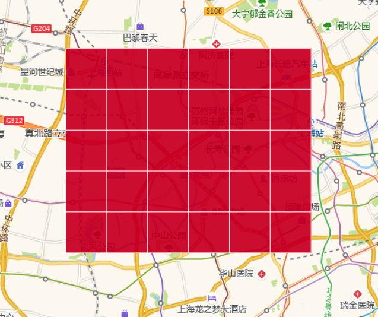

# 网格划分

将给定区域划分为网格，其中包括正方形网格和六边形网格。

## 参数

输入参数：bound（给定区域的geomtry信息转换为bound属性），cellSize（正方形和六边形的边长参数，单位为米）

输出参数：gridGeoms（划分出来的网格的geomtry属性）

## 备注

输入的bound信息是经度和纬度的坐标，输出的网格的坐标也是经度和纬度坐标；

## 示例

### 1.构建四边形格网

```go
package main

import (
	"fmt"

	"github.com/spatial-go/geoos"
	"github.com/spatial-go/geoos/grid"
)

func main() {
	var cellSize float64 = 10000
	bound := geoos.Bound{Min: geoos.Point{116.315732,39.883937}, Max: geoos.Point{116.443076,39.9791}}
	gotGrids := grid.SquareGrid(bound, cellSize)
	fmt.Println(gotGrids)
}
// [[{[[[116.26220486056086 39.841586339409865] [116.26220486056086 39.9315185] [116.379404 39.9315185] [116.379404 39.841586339409865] [116.26220486056086 39.841586339409865]]]} {[[[116.26220486056086 39.9315185] [116.26220486056086 40.02145066059014] [116.379404 40.02145066059014] [116.379404 39.9315185] [116.26220486056086 39.9315185]]]}] [{[[[116.379404 39.841586339409865] [116.379404 39.9315185] [116.49660313943913 39.9315185] [116.49660313943913 39.841586339409865] [116.379404 39.841586339409865]]]} {[[[116.379404 39.9315185] [116.379404 40.02145066059014] [116.49660313943913 40.02145066059014] [116.49660313943913 39.9315185] [116.379404 39.9315185]]]}]]
```

### 2.构建六边形格网

```go
package main

import (
	"fmt"

	"github.com/spatial-go/geoos"
	"github.com/spatial-go/geoos/grid"
)

func main() {
	var cellSize float64 = 10000
	bound := geoos.Bound{Min: geoos.Point{116.315732,39.883937}, Max: geoos.Point{116.443076,39.9791}}
	gotGrids := grid.HexagonGrid(bound, cellSize)
	fmt.Println(gotGrids)
}

// [[{[[[116.37433156971957 39.96182053568833] [116.43293113943913 39.883937] [116.37433156971957 39.806053464311674] [116.25713243028042 39.806053464311674] [116.19853286056086 39.883937] [116.25713243028042 39.96182053568833] [116.37433156971957 39.96182053568833]]]} {[[[116.37433156971957 40.117587607065] [116.43293113943913 40.03970407137667] [116.37433156971957 39.96182053568834] [116.25713243028042 39.96182053568834] [116.19853286056086 40.03970407137667] [116.25713243028042 40.117587607065] [116.37433156971957 40.117587607065]]]}] [{[[[116.55013027887829 40.03970407137666] [116.60872984859785 39.96182053568833] [116.55013027887829 39.883937] [116.43293113943913 39.883937] [116.37433156971957 39.96182053568833] [116.43293113943913 40.03970407137666] [116.55013027887829 40.03970407137666]]]} {[[[116.55013027887829 40.19547114275333] [116.60872984859785 40.117587607065] [116.55013027887829 40.03970407137667] [116.43293113943913 40.03970407137667] [116.37433156971957 40.117587607065] [116.43293113943913 40.19547114275333] [116.55013027887829 40.19547114275333]]]}]]
```